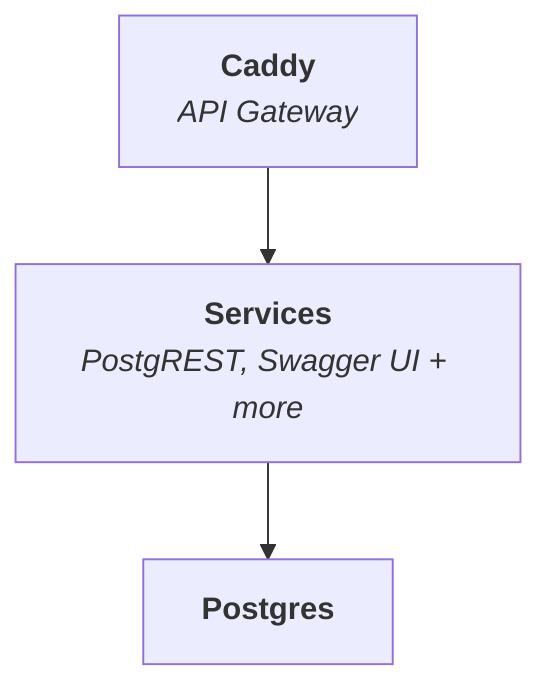

<p align="center">
  
  
</p>

<h1 align="center">SuperStack</h1>

_SuperStack_ is a minimal application backend powered by PostgreSQL
and PostgREST, routed through Caddy. Designed for speed,
simplicity, and composability.



## 🎯 Perfect For

- **Solo developers** who want full backend control
- **Startups** building fast and lean
- **Teams** that value transparency and modularity
- **Enterprises** that prefer composable infrastructure

## 🚀 Quick Start

Clone this repository to start SuperStack:

```sh
git clone https://github.com/explodinglabs/superstack myapp
cd myapp
cp example.env .env
docker compose up
```

Then open [localhost:8000/openapi/](http://localhost:8000/openapi/) to explore
your API in Swagger UI.

## 📚 Full Documentation

👉 [explodinglabs.com/superstack/](https://explodinglabs.com/superstack/)
