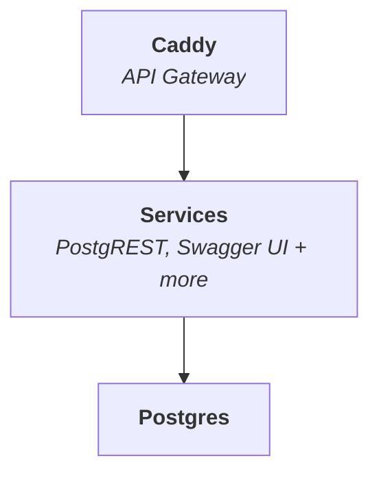

<p align="center">
  
  
</p>

<h1 align="center">
  SuperStack
</h1>

**SuperStack** is a minimal, transparent backend powered by PostgreSQL,
PostgREST, and Swagger UI — all routed through Caddy. It’s designed for speed,
simplicity, and composability.



Everything runs with a single command:

```sh
docker compose up
```

## Who It's For

- Solo developers who want full backend control
- Startups building fast and lean
- Teams that value transparency and modularity
- Enterprises that prefer composable infrastructure

## 🚀 Quick Start

Clone this repository and start SuperStack:

```sh
git clone --depth 1 https://github.com/explodinglabs/superstack myapp
cd myapp
cp example.env .env
docker compose up
```

Then open [localhost:8000/openapi/](https://localhost:8000/openapi/) to explore
your API in Swagger UI.
