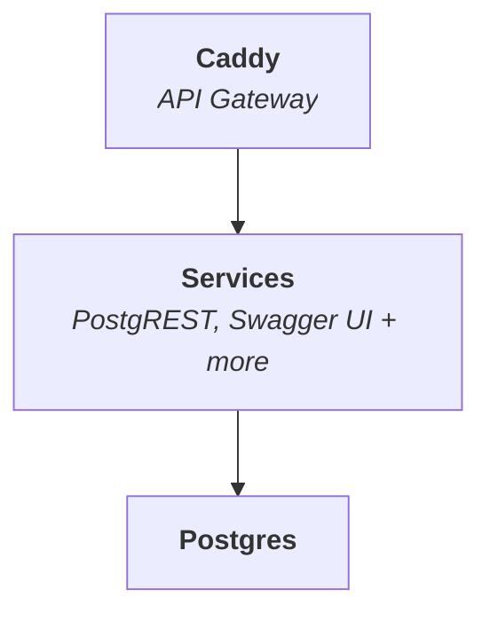

<p align="center">
  
</p>

<h1 align="center">SuperStack</h1>

<p align="center">
  <a href="https://www.explodinglabs.com/superstack/">SuperStack Docs</a>
  | <a href="https://github.com/explodinglabs/superstack/wiki">Developer Wiki</a>
</p>

_SuperStack_ is an **application backend** powered by PostgreSQL and
PostgREST, routed through Caddy. Designed for speed, simplicity, and
composability.



## 🎯 Perfect For

- **Solo developers** who want full backend control
- **Startups** building fast and lean
- **Teams** that value transparency and modularity
- **Enterprises** that prefer composable infrastructure

## 🚀 Quick Start

https://github.com/user-attachments/assets/01f2c3a5-8e56-4f7c-889a-9312c8b1a9bd

1. [Create your repository from the SuperStack template](https://github.com/explodinglabs/superstack/generate)

2. Clone your repository and start SuperStack:

```sh
git clone https://github.com/yourname/myapp.git
cd myapp
cp example.env .env
docker compose up -d
```

Open [http://localhost:8000/openapi/](http://localhost:8000/openapi/) to view
your Swagger UI.

## 📚 Documentation

Explore the full documentation:

📖 [SuperStack Docs](https://www.explodinglabs.com/superstack/) — Everything you need to install, configure, and use SuperStack out of the box.  
🛠️ [Developer Wiki](https://github.com/explodinglabs/superstack/wiki) — A collection of pages to help you add features like authentication, messaging queues, Stripe webhooks, and more.
