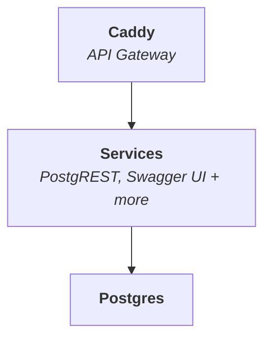

<p align="center">
  
  
</p>

<h1 align="center">
  SuperStack
</h1>

_SuperStack_ is a **minimal backend** designed for rapid application
development. It combines PostgreSQL with a set of modular services — starting
with PostgREST and Swagger UI — that you can extend as needed. All services are
exposed through a Caddy gateway.



SuperStack spins up with a single `docker compose up`. Because it's lightweight,
you can run multiple instances locally for testing and development.

**Who SuperStack Is For:**

- Developers who want full control and transparency over their backend.
- Builders who value fast iteration, low overhead, and Unix-style modularity.
- Teams who find Firebase, Supabase, or Appwrite too heavy, opaque, or locked-in.

## Installation

Clone this repository and start SuperStack:

```sh
git clone --depth 1 https://github.com/explodinglabs/superstack myapp
cd myapp
cp example.env .env
docker compose --env CADDY_AUTO_HTTPS=off up
```

Once it's running, open
[localhost:8000/openapi/](http://localhost:8000/openapi/) to view the Swagger
UI and interact with your API.

## Usage

SuperStack uses [Iko](https://github.com/explodinglabs/iko) for database schema
migrations. On startup, a few base migrations are applied so PostgREST can
function. After that, you’re free to evolve the database however you like.

A wrapper script is included at `bin/iko`, that runs the Iko CLI inside Docker
Compose’s network, allowing it to connect properly to the Postgres container.

```sh
echo 'export PATH="${PWD}/bin:$PATH"' >> ~/.bashrc
```

Run Iko commands like this:

```sh
./bin/iko check
```

To avoid typing `./bin/iko` repeatedly, create an alias:

```sh
alias iko=./bin/iko
```

> **Note:** This iko script differs from the standalone Iko CLI which runs via
> `docker run` — the SuperStack wrapper uses `docker compose run` to integrate
> with SuperStack's Compose networking.

See [Iko's commands]() for the full list of available commands.

## Nuke everything and start over

```sh
docker compose down --volumes
rm -rf migrations
```
