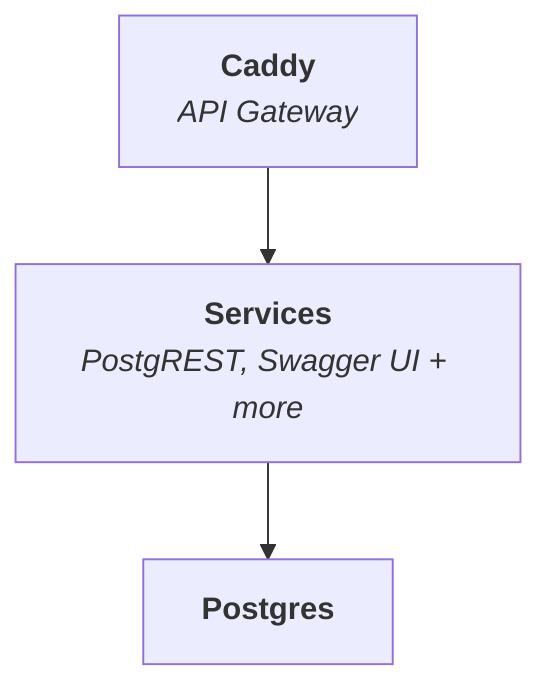

<p align="center">
  
</p>

<h1 align="center">SuperStack</h1>

_SuperStack_ is a minimal **application backend** powered by PostgreSQL and
PostgREST, routed through Caddy. Designed for speed, simplicity, and
composability.



## 🎯 Perfect For

- **Solo developers** who want full backend control
- **Startups** building fast and lean
- **Teams** that value transparency and modularity
- **Enterprises** that prefer composable infrastructure

## 🚀 Quick Start

1. [Create your repository from the SuperStack template](https://github.com/explodinglabs/superstack/generate)

2. Clone your repository and start SuperStack:

```sh
git clone https://github.com/yourname/myapp myapp
cd myapp
cp example.env .env
docker compose up -d
```

3. **Explore your API**

Open [http://localhost:8000/openapi/](http://localhost:8000/openapi/) in your
browser to view and test endpoints using Swagger UI.

## 📚 Full Documentation

👉 [explodinglabs.com/superstack/](https://explodinglabs.com/superstack/)
