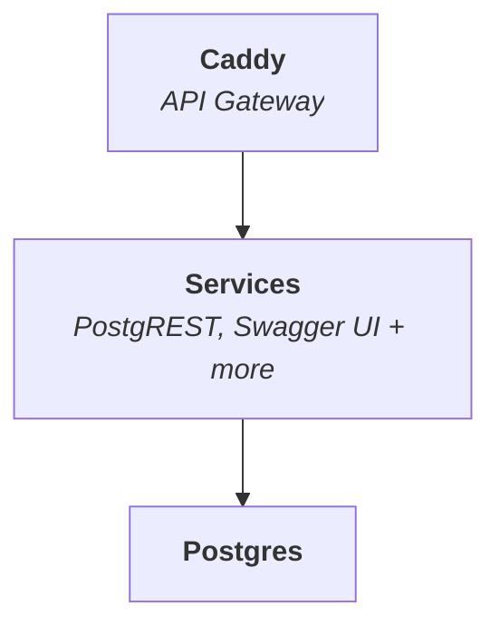

<p align="center">
  
  
</p>

<h1 align="center">
  Minibase
</h1>

<p align="center">
  <i>Minimal, composable, transparent</i>
</p>

_Minibase_ is a **lightweight backend** designed for rapid application
development. It combines PostgreSQL with a set of modular services — starting
with PostgREST and Swagger UI — that you can extend as needed. All services are
exposed through a fast, modern gateway powered by Caddy.



Minibase spins up with a single `docker compose up`. Because it's lightweight,
you can run multiple instances locally for testing and development.

**Who Minibase Is For:**

- Developers who want full control and transparency over their backend.
- Builders who value fast iteration, low overhead, and Unix-style modularity.
- Teams who find Firebase, Supabase, or Appwrite too heavy, opaque, or locked-in.

## Installation

Clone this repository and start Minibase:

```sh
git clone --depth 1 https://github.com/explodinglabs/minibase myapp
cd myapp
cp example.env .env
docker compose up
```

A Swagger UI is available at
[localhost:8000/openapi/](http://localhost:8000/openapi/)

## Usage

Minibase uses [Iko](https://github.com/explodinglabs/iko) for database schema
migrations. On startup, a few migrations are made for PostgREST to work. From
there, you can start iterating on the database for your own needs.

Create an Iko command in your local shell:

```sh
iko() { docker compose run --rm -it --no-deps -v ${PWD}/migrations:/repo:rw -v ${PWD}/scripts:/scripts:ro -v ${PWD}/caddy/conf:/etc/caddy:ro --env CADDY_AUTO_HTTPS=off iko "$@" }
```

Ensure it's working with:

```sh
$ iko check
Checking db:postgres://admin@postgres:5432/app
Check successful
```

## Nuke everything

```sh
docker compose down --volumes
rm -rf migrations
```

## Environments

To deploy your app to other environments, you have a few options.

### 1. Version control

- Commit the migrations to your repository
- Push
- Pull changes on the remote server
- `docker compose run --rm iko deploy`

### 2. Build your container image with migrations included

- Build a custom Iko image using the Dockerfile included in this repo just for
  this purpose: `docker build -t yourrepo/youriko .`
- `docker push yourrepo/youriko`

Then on the remote server:

- `docker pull yourrepo/youriko`
- Update the compose.yaml to use your Iko image
- `docker compose run --rm iko deploy`

### 3. Copy migrations to remote

This is another option.
