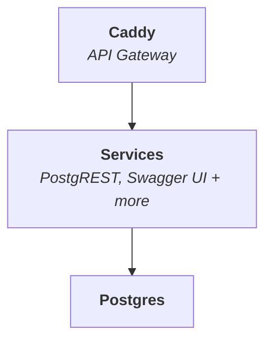

<p align="center">
  
  
</p>

<h1 align="center">
  Minibase
</h1>

<p align="center">
  <i>Minimal, composable, transparent</i>
</p>

_Minibase_ is a **lightweight backend** designed for rapid application
development. It combines PostgreSQL with a set of modular services — starting
with PostgREST and Swagger UI — that you can extend as needed. All services are
exposed through a fast, modern gateway powered by Caddy.



Minibase spins up with a single `docker compose up`. Because it's lightweight,
you can run multiple instances locally for testing and development.

**Who Minibase Is For:**

- Developers who want full control and transparency over their backend.
- Builders who value fast iteration, low overhead, and Unix-style modularity.
- Teams who find Firebase, Supabase, or Appwrite too heavy, opaque, or locked-in.

## Installation

Clone this repository and start Minibase:

```sh
git clone --depth 1 https://github.com/explodinglabs/minibase myapp
cd myapp
cp example.env .env
docker compose up
```

Once it's running, open
[localhost:8000/openapi/](http://localhost:8000/openapi/) to view the Swagger
UI and interact with your API.

## Usage

Minibase uses [Iko](https://github.com/explodinglabs/iko) for database schema
migrations. On startup, a few base migrations are applied so PostgREST can
function. From there, you're free to evolve the database however you like.

```sh
alias iko=./bin/iko
```

```sh
$ iko check
Checking db:postgres://admin@postgres:5432/app
Check successful
```

See [Iko's documentation](https://github.com/explodinglabs/iko).

## Nuke everything and start over

```sh
docker compose down --volumes
rm -rf migrations
```
