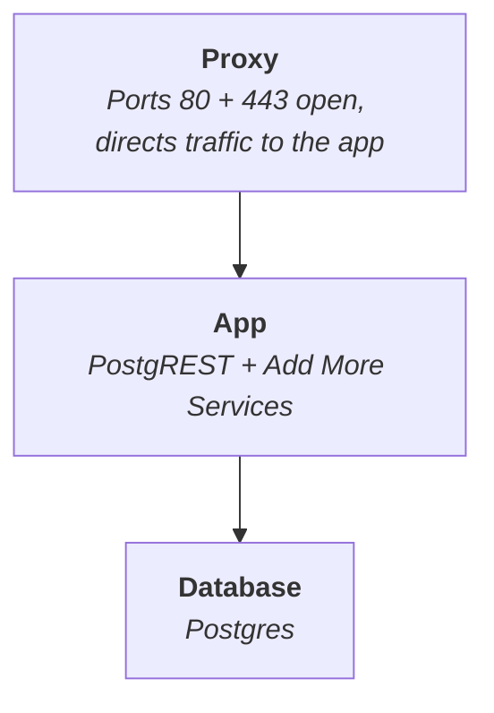

<p align="center">
  
</p>

<h1 align="center">SuperStack</h1>

<p align="center">
  <a href="https://explodinglabs.com/superstack/">SuperStack Docs</a>
  | <a href="https://github.com/explodinglabs/superstack/wiki">Developer Wiki</a>
</p>

_SuperStack_ is an **application backend** powered by PostgreSQL and PostgREST,
routed through Caddy. Designed for speed, simplicity, and extensibility.



## 🎯 Perfect For

- **Solo developers** who want full backend control
- **Startups** building fast and lean
- **Teams** that value transparency and modularity
- **Enterprises** that prefer composable infrastructure

## 🚀 Quick Start

https://github.com/user-attachments/assets/5b53338a-9eef-405c-820c-cd5253f09d0d

1. [Create your repository from the SuperStack template](https://github.com/explodinglabs/superstack/generate)

2. Clone your repository:

```sh
git clone https://github.com/yourname/myapp.git
cd myapp
```

3. Create environment files:

```sh
cp db/example.env db/.env
cp app/example.env app/.env
```

4. Start the db, proxy and app stack:

```sh
cd db && docker compose up -d
cd ../proxy && docker compose up -d
cd ../app && docker compose up -d
```

## 📚 Documentation

📖 [SuperStack Docs](https://explodinglabs.com/superstack/) — Everything you
need to install, configure, and use SuperStack out of the box.

🛠️ [Developer Wiki](https://github.com/explodinglabs/superstack/wiki) — A
collection of pages to help you add features like authentication, messaging
queues, Stripe webhooks, etc.
