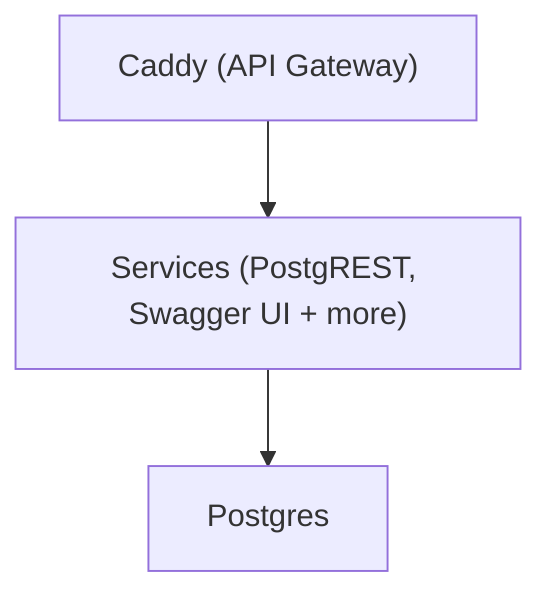

# 🚀 Getting Started

SuperStack uses Docker, so make sure [Docker is
installed](https://docs.docker.com/get-docker/) before you begin.

## 1. Clone SuperStack

```sh
git clone https://github.com/explodinglabs/superstack myapp
cd myapp
```

<details>
<summary>Click here to see how to change this clone to point "origin" to your own hosted repository (Recommended)</summary>

Rename "origin" to "upstream":

```sh
git remote rename origin upstream
```

This way you can still upgrade to a more recent SuperStack with:

```sh
git pull upstream main
```

Add your own code repository:

```sh
git remote add origin https://github.com/yourname/myapp
```

Now you can pull/push to your own repo as normal:

```sh
git pull
git push origin head
```

### Why not just fork SuperStack?

Because you can't make a fork private.

### Why not make SuperStack a template repo?

Because then you can't pull from upstream SuperStack.

</details>

## 2. Configure Environment Variables

Copy the example file:

```sh
cp example.env .env
```

> ⚠️ The .env file is for local development only. For remote deployments,
> set environment variables using CI/CD or inline in the `docker compose up` command (be sure to avoid saving secrets in shell history).

## 3. Start the Stack

```sh
docker compose up -d
```

That's it – your backend is live.

You can now open [localhost:8000/openapi/](http://localhost:8000/openapi/)
to explore your API.

---

## 🧩 What Just Happened?

SuperStack automatically:

- Starts a fresh **Postgres** database
- Applies initial **migrations**
- Launches **PostgREST** and **Swagger UI**
- Serves everything through **Caddy**



> 💡 Only Caddy exposes a port – all services are routed through it.

## Nuke everything

To wipe your stack and start clean:

```sh
docker compose down --volumes
```

## ➕ What's Next?

👉 [Create your database schema with migrations](migrations.md)  
👉 [Deploy to a remote environment](deploying.md)
