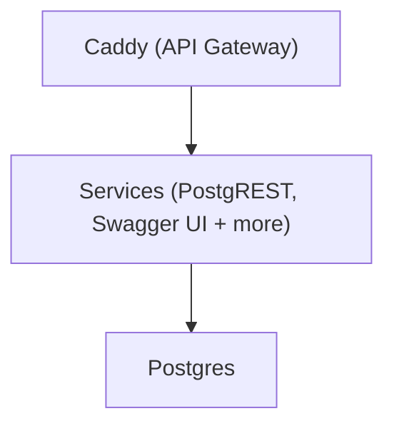

# 🚀 Getting Started

SuperStack uses Docker, so make sure [Docker is
installed](https://docs.docker.com/get-docker/) before you begin.

## 1. Create a New Project from the Template

Click [Use this template](https://github.com/explodinglabs/superstack/generate) to create your own repository.

## 2. Clone Your New Repository

```sh
git clone https://github.com/yourname/myapp
cd myapp
```

## 3. Configure Environment Variables

Copy the example file:

```sh
cp example.env .env
```

> 💡 The .env file is for local development only. For remote deployments, set
> secrets using CI/CD or inline environment variables (avoid saving secrets in
> shell history).

## 4. Start the Stack

```sh
docker compose up -d
```

That's it – your backend is live.

You can now open [localhost:8000/openapi/](http://localhost:8000/openapi/)
to explore your API.

---

## 🧩 What Just Happened?

SuperStack automatically:

- Starts a fresh **Postgres** database
- Applies initial **migrations**
- Launches **PostgREST** and **Swagger UI**
- Serves everything through **Caddy**



> 💡 Only Caddy exposes a port – all services are routed through it.

## Nuke everything

To wipe your stack and start clean:

```sh
docker compose down --volumes
```

## ➕ What's Next?

👉 [Create your database schema and migrations](migrations.md)  
👉 [Deploy to a remote environment](deploying.md)
