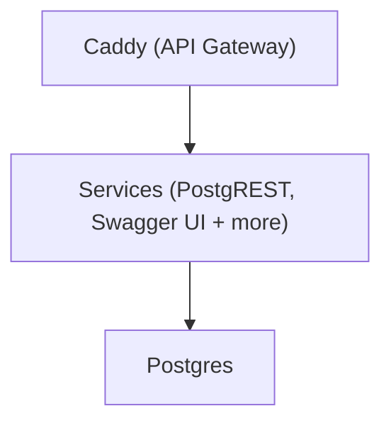

# 🚀 Getting Started

SuperStack uses Docker, so make sure [Docker is
installed](https://docs.docker.com/get-docker/) before you begin.

## Get SuperStack

### Option 1: Use the Template (Recommended)

The easiest way to get started:

Click [Use this template](https://github.com/explodinglabs/superstack/generate)
and create a new repository (e.g. `myapp`) on GitHub.

Clone your new repository:

```sh
git clone https://github.com/yourname/myapp.git
cd myapp
```

### Option 2: Clone and Track Upstream (Advanced)

If you want to keep SuperStack’s Git history and pull upstream SuperStack
changes later, clone SuperStack:

```sh
git clone https://github.com/explodinglabs/superstack.git myapp
cd myapp
```

Create your own repo at [https://github.com/new](https://github.com/new), then:

```sh
git remote rename origin upstream
git remote add origin https://github.com/yourname/myapp.git
git push -u origin main
```

You can now pull upstream changes with:

```sh
git pull upstream main
```

## 2. Configure Environment Variables

Copy the example file:

```sh
cp example.env .env
```

> ⚠️ The .env file is for local development only. For remote deployments,
> set environment variables using CI/CD or inline in the `docker compose up` command (be sure to avoid saving secrets in shell history).

## 3. Start the Stack

```sh
docker compose up -d
```

That's it – your backend is live.

You can now open
[https://localhost:8000/openapi/](http://localhost:8000/openapi/) to explore
your API.

---

## 🧩 What Just Happened?

SuperStack automatically:

- Starts a fresh **Postgres** database
- Applies initial **migrations**
- Launches **PostgREST** and **Swagger UI**
- Serves everything through **Caddy**



> 💡 Only Caddy exposes a port – all services are routed through it.

## Nuke everything

To wipe your stack and start clean:

```sh
docker compose down --volumes
```

## ➕ What's Next?

👉 [Create your database schema with migrations](migrations.md)  
👉 [Deploy to a remote environment](deploying.md)
