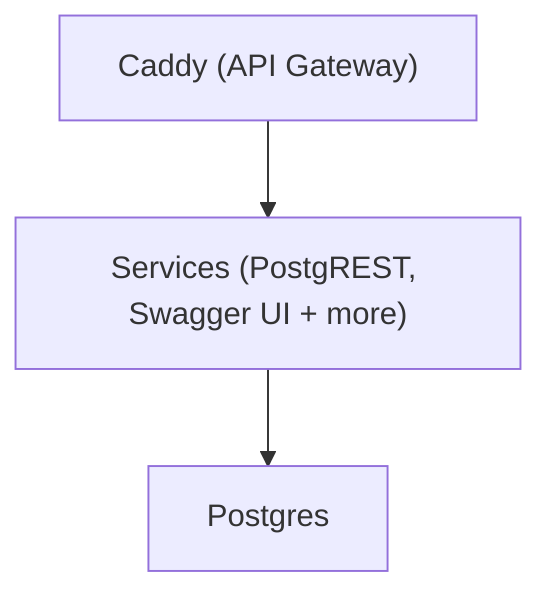

# 🚀 Getting Started

Spin up a full-featured backend in seconds. SuperStack uses Docker, so make sure Docker is installed before you begin.

## 1. Clone the Repository

```sh
git clone https://github.com/explodinglabs/superstack myapp
cd myapp
```

## 2. Configure Your Environment

Compy the example environment file:

```sh
cp example.env .env
```

Edit `.env` to set your database credentials and secrets.

## 3. Start SuperStack

```sh
docker compose up -d
```

That's it – your backend is live.

---

## 🧩 What Just Happened?

SuperStack automatically:

- Starts a fresh **Postgres** database
- Applies initial **migrations**
- Launches **PostgREST** and **Swagger UI**
- Serves everything through **Caddy** on http://localhost:8000



> 💡 Only Caddy exposes a port – all services are routed through it.

You can now open [localhost:8000/openapi/](http://localhost:8000/openapi/)
to explore your API.

## Notes

- Services are configured in `compose.yaml` (shared) and
  `compose.override.yaml` (dev-only).
- The `.env` file is for **local development only**. For remote
  deployments, set secrets via CI/CD or with `docker compose --env` (avoid
  leaking secrets to shell history).

## Nuke everything

To wipe your stack and start clean:

```sh
docker compose down --volumes
```

## ➕ What's Next?

👉 [Create your database schema and migrations](migrations.md)
👉 [Deploy to a remote environment](deploying.md)
