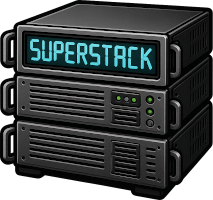

# SuperStack

_SuperStack_ is an **application backend** powered by PostgreSQL.

---

## 🚀 What can I do with SuperStack?

SuperStack gives you a fully working backend with zero setup — just clone
and run.

It's perfect for:

- Building SaaS apps
- Running multiple stacks locally
- Easy database migrations
- Customizing your toolchain

---

## 📚 Documentation

- [Getting Started](gettingstarted.md)
- [Migrations](migrations.md)
- [Postgres Extensions](extensions.md)
- [Psql](psql.md)
- [Deploying to Remote Environments](deploying.md)
